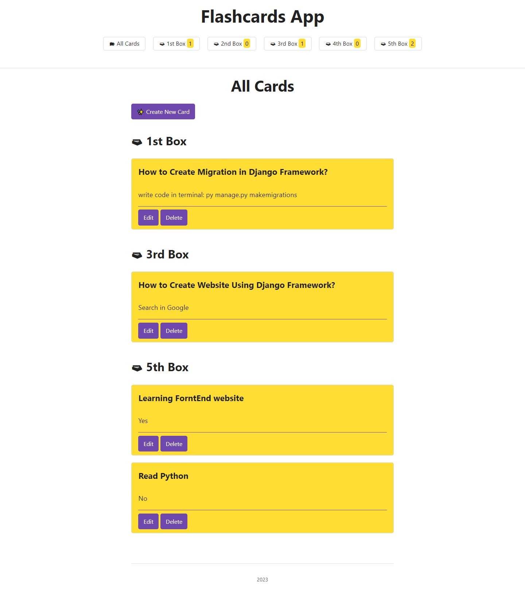
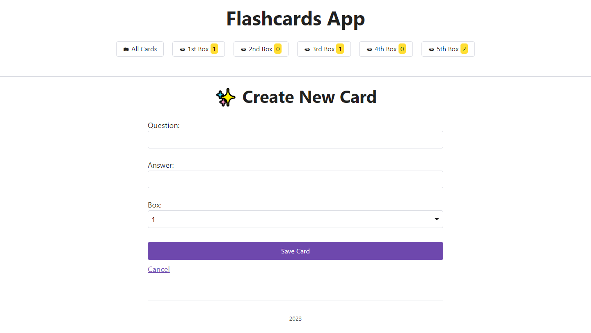
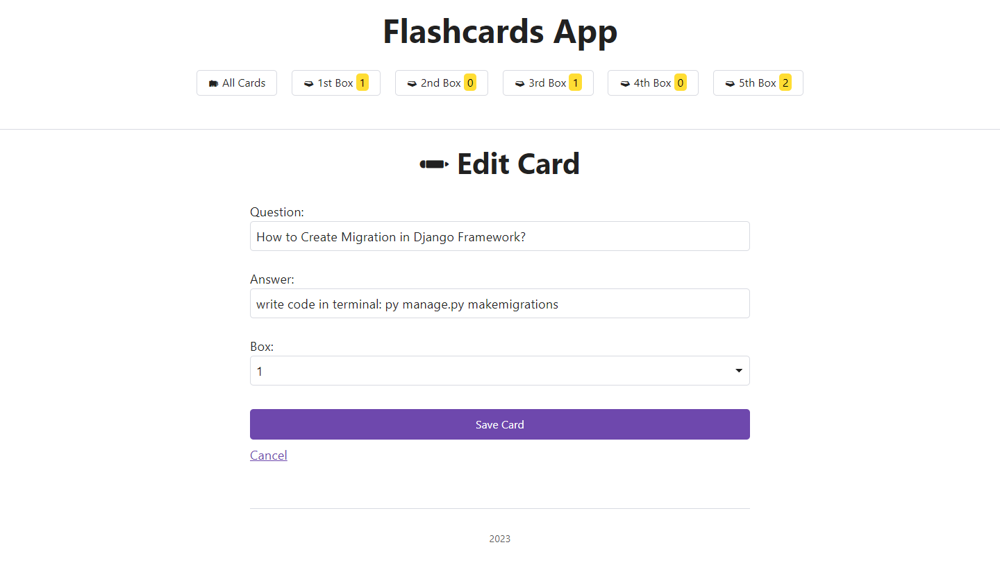
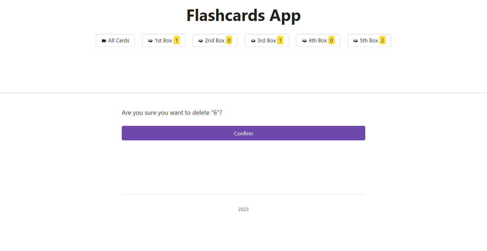
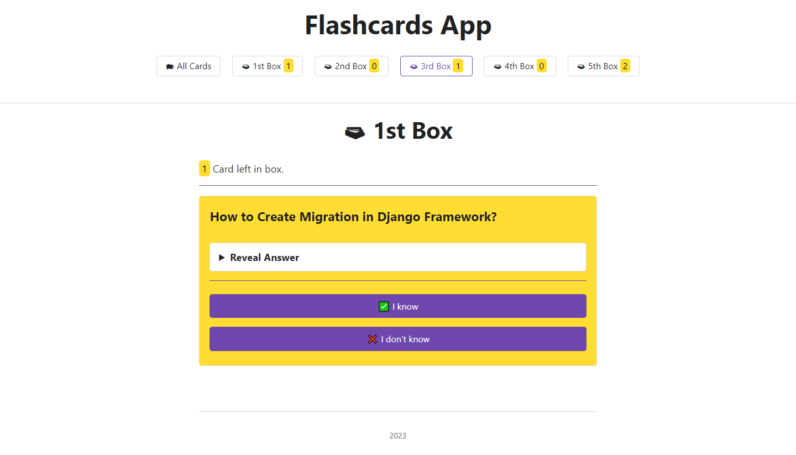

# flashcard


## Flashcards:
are a great tool when you want to memorize a new topic or learn a new language. You write a question on the front of the card and the answer on the back of the card. Then you can test your memory by going through the flashcards. The more often you show a card to yourself, the better your chances of memorizing its content. With Django, you can build your own flashcards app.


## Code

### Step 1: Prepare your Django Project

```
mkdir flashcards_app
cd flashcards_app
python -m venv venv
.\venv\Scripts\activate
```
### Add Dependencies
pip:

 ```
 python -m pip install django
  ```
  ### Initiate Your Django Project
```
django-admin startproject flashcards
```
it’ll run your development web server:
```
python manage.py runserver
```

-----------------
## Main Page Site




<code>Create Flashcard </code>



<code>Edit Flashcard </code>



<code> Delete Flashcard</code>




<code>Show Boxs</code>




---------------
# Installation
```
pip install django
virtualenv env
```
# For Mac/ Linux
```
source env/bin/activate
```
# For Window
```
env\scripts\activate

pip install -r requirements.txt

python manage.py makemigrations

python manage.py migrate

python manage.py runserver
```
# For Admin Login
```
python manage.py createsuperuser
Username : admin
Password : admin123
```